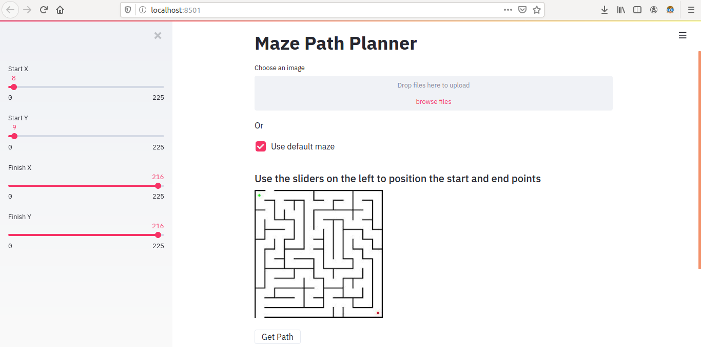
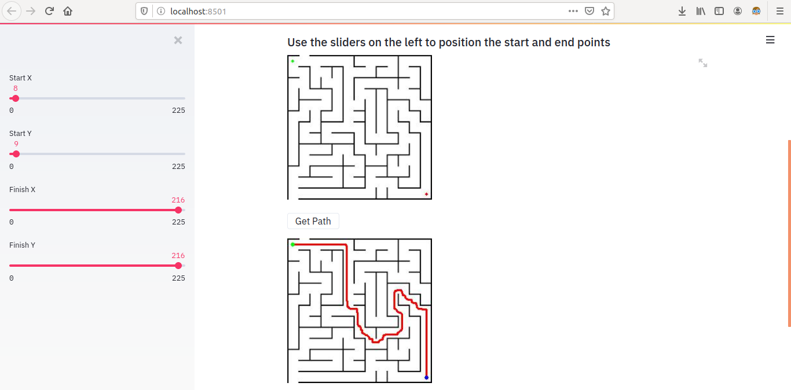

# Maze Path Planner

**About**
---
Simple ui based maze path finder using dijkstra's algorithm.

**Prerequisites**
---
`python3.5+` and following `pip` packages need to be installed:  
+ [`opencv-python`](https://pypi.org/project/opencv-python/3.4.9.33/)
+ [`streamlit`](https://pypi.org/project/streamlit/)
+ [`numpy`](https://pypi.org/project/numpy/)

*Note: Tested with python 3.6.9 with ui running on Firefox.*  

**Usage**
---
Open terminal at project directory and do the following:  
1. Run the following command:
    + `$ streamlit run ui_app.py`  
    This will open the ui interface in your default browser as shown:  

    
2. Next, browse and open your maze image or use the provided default.  
    __*Note: The selected maze should be normal 3 channel RGB image in jpg or png format.*__  
      
3. Adjust the side bars on the left to fix start and finish positions on the maze.  
4. Click on **Get Path** button for the solution.  
  
    
